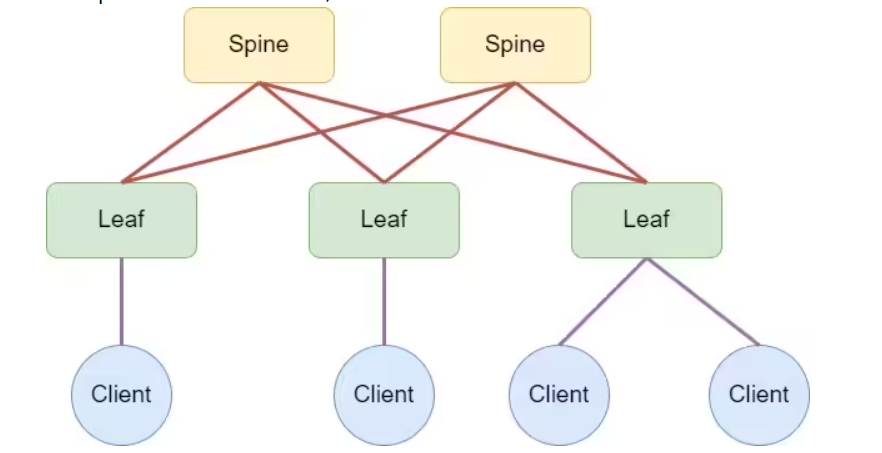
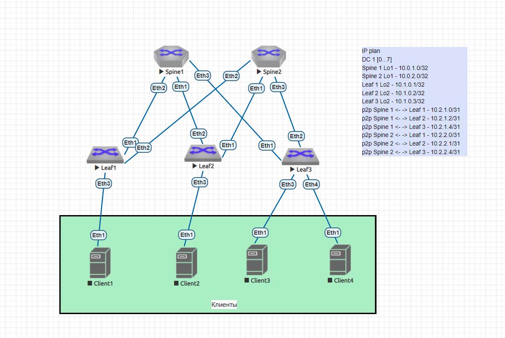

  # Проектирование адресного пространства

## Цель:
- Собрать схему CLOS;
- Распределить адресное пространство;

## Описание/Пошаговая инструкция выполнения домашнего задания:

1) Соберете топологию CLOS, как на схеме:
   
3) Распределите адресное пространство для Underlay сети
4) Зафиксируете в документации на github адресное пространство, схему сети, настройки

## Решение

### Распределение адресного пространства

    IP plan
    DC 1 [0...7]
    Loopback
    Spine 1 Lo1 - 10.0.1.0/32
    Spine 2 Lo1 - 10.0.2.0/32
    Leaf 1 Lo2 - 10.1.0.1/32
    Leaf 2 Lo2 - 10.1.0.2/32
    Leaf 3 Lo2 - 10.1.0.3/32
    Service
    p2p Spine 1 <- -> Leaf 1 - 10.2.1.0/31
    p2p Spine 1 <- -> Leaf 2 - 10.2.1.2/31
    p2p Spine 1 <- -> Leaf 3 - 10.2.1.4/31
    p2p Spine 2 <- -> Leaf 1 - 10.2.2.0/31
    p2p Spine 2 <- -> Leaf 2 - 10.2.2.1/31
    p2p Spine 2 <- -> Leaf 3 - 10.2.2.4/31

### Схема сети

### Настройки оборудования

Spine1

      1 interface loopback1
      2 ip address 10.0.1.0/32
      3 interface ethernet1 
      4 ip address 10.2.1.2/31
      5 interface ethernet2
      6 ip address 10.2.1.0/31
      7 interface ethernet2
      8 ip address 10.2.1.4/31
      
Spine2    

      1 interface loopback1
      2 ip address 10.0.2.0/32
      3 interface ethernet1 
      4 ip address 10.2.2.1/31
      5 interface ethernet2
      6 ip address 10.2.2.0/31
      7 interface ethernet2
      8 ip address 10.2.2.4/31

Leaf1

      1 interface loopback2
      2 ip address 10.1.0.1/32

Leaf2

      1 interface loopback2
      2 ip address 10.1.0.2/32

Leaf3

      1 interface loopback2
      2 ip address 10.1.0.3/32
