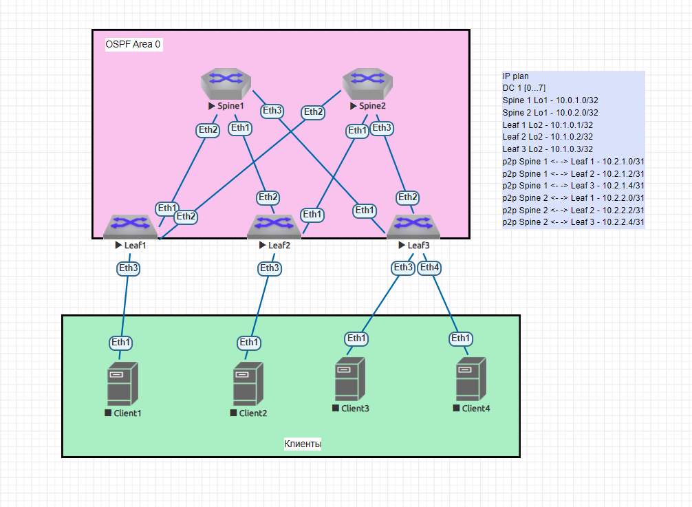

  # Underlay. OSPF

## Цель:
- Настроить OSPF для Underlay сети

## Описание/Пошаговая инструкция выполнения домашнего задания:

В этой самостоятельной работе мы ожидаем, что вы самостоятельно:

1) Настроите OSPF в Underlay сети, для IP связанности между всеми сетевыми устройствами.
2) Зафиксируете в документации - план работы, адресное пространство, схему сети, конфигурацию устройств
3) Убедитесь в наличии IP связанности между устройствами в OSFP домене

## Решение:

### План работы

Топология и распределение адресного пространства берутся из [lab01](https://github.com/samartyanov/otus-design-of-data-center-networks/tree/main/homework/lab01#%D0%BE%D0%BF%D0%B8%D1%81%D0%B0%D0%BD%D0%B8%D0%B5%D0%BF%D0%BE%D1%88%D0%B0%D0%B3%D0%BE%D0%B2%D0%B0%D1%8F-%D0%B8%D0%BD%D1%81%D1%82%D1%80%D1%83%D0%BA%D1%86%D0%B8%D1%8F-%D0%B2%D1%8B%D0%BF%D0%BE%D0%BB%D0%BD%D0%B5%D0%BD%D0%B8%D1%8F-%D0%B4%D0%BE%D0%BC%D0%B0%D1%88%D0%BD%D0%B5%D0%B3%D0%BE-%D0%B7%D0%B0%D0%B4%D0%B0%D0%BD%D0%B8%D1%8F)
После выполняется настройка OSPF на Spine и Leaf и проверка.
Интервалы OSPF по умолчанию: 10 секунд для hello и 40 секунд для dead. 

### Распределение адресного пространства

    IP plan
    DC 1 [0...7]
    Loopback
    Spine 1 Lo1 - 10.0.1.0/32
    Spine 2 Lo1 - 10.0.2.0/32
    Leaf 1 Lo2 - 10.1.0.1/32
    Leaf 2 Lo2 - 10.1.0.2/32
    Leaf 3 Lo2 - 10.1.0.3/32
    Service
    p2p Spine 1 <- -> Leaf 1 - 10.2.1.0/31
    p2p Spine 1 <- -> Leaf 2 - 10.2.1.2/31
    p2p Spine 1 <- -> Leaf 3 - 10.2.1.4/31
    p2p Spine 2 <- -> Leaf 1 - 10.2.2.0/31
    p2p Spine 2 <- -> Leaf 2 - 10.2.2.2/31
    p2p Spine 2 <- -> Leaf 3 - 10.2.2.4/31
    
### Схема сети

### Настройки оборудования

Spine1

      1 Spine1(config)#ip routing
      2 Spine1(config)#router ospf 1
      3 Spine1(config-router-ospf)#network 10.0.1.0 0.0.0.0 area 0
      4 Spine1(config-router-ospf)#network 10.2.1.2 0.0.0.1 area 0
      5 Spine1(config-router-ospf)#network 10.2.1.0 0.0.0.1 area 0
      6 Spine1(config-router-ospf)#network 10.2.1.4 0.0.0.1 area 0
      7 Spine1(config-router-ospf)#router-id 10.0.1.0
      
Spine2    

      1 Spine2(config)#ip routing
      2 Spine2(config)#router ospf 1
      3 Spine2(config-router-ospf)#network 10.0.2.0 0.0.0.0 area 0
      4 Spine2(config-router-ospf)#network 10.2.2.2 0.0.0.1 area 0
      5 Spine2(config-router-ospf)#network 10.2.2.0 0.0.0.1 area 0
      6 Spine2(config-router-ospf)#network 10.2.2.4 0.0.0.1 area 0
      7 Spine2(config-router-ospf)#router-id 10.0.2.0

Leaf1

      1 Leaf1(config)#ip routing
      2 Leaf1(config)#router ospf 1
      3 Leaf1(config-router-ospf)#network 10.1.0.1 0.0.0.0 area 0
      4 Leaf1(config-router-ospf)#network 10.2.1.0 0.0.0.1 area 0
      5 Leaf1(config-router-ospf)#network 10.2.2.0 0.0.0.1 area 0
      6 Leaf1(config-router-ospf)#router-id 10.1.0.1
      

Leaf2

      1 Leaf2(config)#ip routing
      2 Leaf2(config)#router ospf 1
      3 Leaf2(config-router-ospf)#network 10.1.0.2 0.0.0.0 area 0
      4 Leaf2(config-router-ospf)#network 10.2.2.2 0.0.0.1 area 0
      5 Leaf2(config-router-ospf)#network 10.2.1.2 0.0.0.1 area 0
      6 Leaf2(config-router-ospf)#router-id 10.1.0.2
      

Leaf3

      1 Leaf3(config)#ip routing
      2 Leaf3(config)#router ospf 1
      3 Leaf3(config-router-ospf)#network 10.1.0.3 0.0.0.0 area 0
      4 Leaf3(config-router-ospf)#network 10.2.1.4 0.0.0.1 area 0
      5 Leaf3(config-router-ospf)#network 10.2.2.4 0.0.0.1 area 0
      6 Leaf3(config-router-ospf)#router-id 10.1.0.3
      
### Проверка настройки протокола OSPF

Spine1

      Spine1#sh ip route

      VRF: default
      Codes: C - connected, S - static, K - kernel, 
             O - OSPF, IA - OSPF inter area, E1 - OSPF external type 1,
             E2 - OSPF external type 2, N1 - OSPF NSSA external type 1,
             N2 - OSPF NSSA external type2, B - Other BGP Routes,
             B I - iBGP, B E - eBGP, R - RIP, I L1 - IS-IS level 1,
             I L2 - IS-IS level 2, O3 - OSPFv3, A B - BGP Aggregate,
             A O - OSPF Summary, NG - Nexthop Group Static Route,
             V - VXLAN Control Service, M - Martian,
             DH - DHCP client installed default route,
             DP - Dynamic Policy Route, L - VRF Leaked,
             G  - gRIBI, RC - Route Cache Route

      Gateway of last resort is not set

         C        10.0.1.0/32 is directly connected, Loopback1
         O        10.0.2.0/32 [110/30] via 10.2.1.3, Ethernet1
                               via 10.2.1.1, Ethernet2
                               via 10.2.1.5, Ethernet3
         O        10.1.0.1/32 [110/20] via 10.2.1.1, Ethernet2
         O        10.1.0.2/32 [110/20] via 10.2.1.3, Ethernet1
         O        10.1.0.3/32 [110/20] via 10.2.1.5, Ethernet3
         C        10.2.1.0/31 is directly connected, Ethernet2
         C        10.2.1.2/31 is directly connected, Ethernet1
         C        10.2.1.4/31 is directly connected, Ethernet3
         O        10.2.2.0/31 [110/20] via 10.2.1.1, Ethernet2
         O        10.2.2.2/31 [110/20] via 10.2.1.3, Ethernet1
         O        10.2.2.4/31 [110/20] via 10.2.1.5, Ethernet3
     
      
Spine2    

     Spine2#sh ip route

VRF: default
Codes: C - connected, S - static, K - kernel, 
       O - OSPF, IA - OSPF inter area, E1 - OSPF external type 1,
       E2 - OSPF external type 2, N1 - OSPF NSSA external type 1,
       N2 - OSPF NSSA external type2, B - Other BGP Routes,
       B I - iBGP, B E - eBGP, R - RIP, I L1 - IS-IS level 1,
       I L2 - IS-IS level 2, O3 - OSPFv3, A B - BGP Aggregate,
       A O - OSPF Summary, NG - Nexthop Group Static Route,
       V - VXLAN Control Service, M - Martian,
       DH - DHCP client installed default route,
       DP - Dynamic Policy Route, L - VRF Leaked,
       G  - gRIBI, RC - Route Cache Route

Gateway of last resort is not set

 O        10.0.1.0/32 [110/30] via 10.2.2.3, Ethernet1
                               via 10.2.2.1, Ethernet2
                               via 10.2.2.5, Ethernet3
 C        10.0.2.0/32 is directly connected, Loopback1
 O        10.1.0.1/32 [110/20] via 10.2.2.1, Ethernet2
 O        10.1.0.2/32 [110/20] via 10.2.2.3, Ethernet1
 O        10.1.0.3/32 [110/20] via 10.2.2.5, Ethernet3
 O        10.2.1.0/31 [110/20] via 10.2.2.1, Ethernet2
 O        10.2.1.2/31 [110/20] via 10.2.2.3, Ethernet1
 O        10.2.1.4/31 [110/20] via 10.2.2.5, Ethernet3
 C        10.2.2.0/31 is directly connected, Ethernet2
 C        10.2.2.2/31 is directly connected, Ethernet1
 C        10.2.2.4/31 is directly connected, Ethernet3

Leaf1

       Leaf1#sh ip route

VRF: default
Codes: C - connected, S - static, K - kernel, 
       O - OSPF, IA - OSPF inter area, E1 - OSPF external type 1,
       E2 - OSPF external type 2, N1 - OSPF NSSA external type 1,
       N2 - OSPF NSSA external type2, B - Other BGP Routes,
       B I - iBGP, B E - eBGP, R - RIP, I L1 - IS-IS level 1,
       I L2 - IS-IS level 2, O3 - OSPFv3, A B - BGP Aggregate,
       A O - OSPF Summary, NG - Nexthop Group Static Route,
       V - VXLAN Control Service, M - Martian,
       DH - DHCP client installed default route,
       DP - Dynamic Policy Route, L - VRF Leaked,
       G  - gRIBI, RC - Route Cache Route

Gateway of last resort is not set

 O        10.0.1.0/32 [110/20] via 10.2.1.0, Ethernet1
 O        10.0.2.0/32 [110/20] via 10.2.2.0, Ethernet2
 C        10.1.0.1/32 is directly connected, Loopback2
 O        10.1.0.2/32 [110/30] via 10.2.1.0, Ethernet1
                               via 10.2.2.0, Ethernet2
 O        10.1.0.3/32 [110/30] via 10.2.1.0, Ethernet1
                               via 10.2.2.0, Ethernet2
 C        10.2.1.0/31 is directly connected, Ethernet1
 O        10.2.1.2/31 [110/20] via 10.2.1.0, Ethernet1
 O        10.2.1.4/31 [110/20] via 10.2.1.0, Ethernet1
 C        10.2.2.0/31 is directly connected, Ethernet2
 O        10.2.2.2/31 [110/20] via 10.2.2.0, Ethernet2
 O        10.2.2.4/31 [110/20] via 10.2.2.0, Ethernet2
      

Leaf2

      Leaf2#sh ip route

VRF: default
Codes: C - connected, S - static, K - kernel, 
       O - OSPF, IA - OSPF inter area, E1 - OSPF external type 1,
       E2 - OSPF external type 2, N1 - OSPF NSSA external type 1,
       N2 - OSPF NSSA external type2, B - Other BGP Routes,
       B I - iBGP, B E - eBGP, R - RIP, I L1 - IS-IS level 1,
       I L2 - IS-IS level 2, O3 - OSPFv3, A B - BGP Aggregate,
       A O - OSPF Summary, NG - Nexthop Group Static Route,
       V - VXLAN Control Service, M - Martian,
       DH - DHCP client installed default route,
       DP - Dynamic Policy Route, L - VRF Leaked,
       G  - gRIBI, RC - Route Cache Route

Gateway of last resort is not set

 O        10.0.1.0/32 [110/20] via 10.2.1.2, Ethernet2
 O        10.0.2.0/32 [110/20] via 10.2.2.2, Ethernet1
 O        10.1.0.1/32 [110/30] via 10.2.2.2, Ethernet1
                               via 10.2.1.2, Ethernet2
 C        10.1.0.2/32 is directly connected, Loopback2
 O        10.1.0.3/32 [110/30] via 10.2.2.2, Ethernet1
                               via 10.2.1.2, Ethernet2
 O        10.2.1.0/31 [110/20] via 10.2.1.2, Ethernet2
 C        10.2.1.2/31 is directly connected, Ethernet2
 O        10.2.1.4/31 [110/20] via 10.2.1.2, Ethernet2
 O        10.2.2.0/31 [110/20] via 10.2.2.2, Ethernet1
 C        10.2.2.2/31 is directly connected, Ethernet1
 O        10.2.2.4/31 [110/20] via 10.2.2.2, Ethernet1
      

Leaf3

Leaf3#sh ip route

VRF: default
Codes: C - connected, S - static, K - kernel, 
       O - OSPF, IA - OSPF inter area, E1 - OSPF external type 1,
       E2 - OSPF external type 2, N1 - OSPF NSSA external type 1,
       N2 - OSPF NSSA external type2, B - Other BGP Routes,
       B I - iBGP, B E - eBGP, R - RIP, I L1 - IS-IS level 1,
       I L2 - IS-IS level 2, O3 - OSPFv3, A B - BGP Aggregate,
       A O - OSPF Summary, NG - Nexthop Group Static Route,
       V - VXLAN Control Service, M - Martian,
       DH - DHCP client installed default route,
       DP - Dynamic Policy Route, L - VRF Leaked,
       G  - gRIBI, RC - Route Cache Route

Gateway of last resort is not set

 O        10.0.1.0/32 [110/20] via 10.2.1.4, Ethernet1
 O        10.0.2.0/32 [110/20] via 10.2.2.4, Ethernet2
 O        10.1.0.1/32 [110/30] via 10.2.1.4, Ethernet1
                               via 10.2.2.4, Ethernet2
 O        10.1.0.2/32 [110/30] via 10.2.1.4, Ethernet1
                               via 10.2.2.4, Ethernet2
 C        10.1.0.3/32 is directly connected, Loopback2
 O        10.2.1.0/31 [110/20] via 10.2.1.4, Ethernet1
 O        10.2.1.2/31 [110/20] via 10.2.1.4, Ethernet1
 C        10.2.1.4/31 is directly connected, Ethernet1
 O        10.2.2.0/31 [110/20] via 10.2.2.4, Ethernet2
 O        10.2.2.2/31 [110/20] via 10.2.2.4, Ethernet2
 C        10.2.2.4/31 is directly connected, Ethernet2
