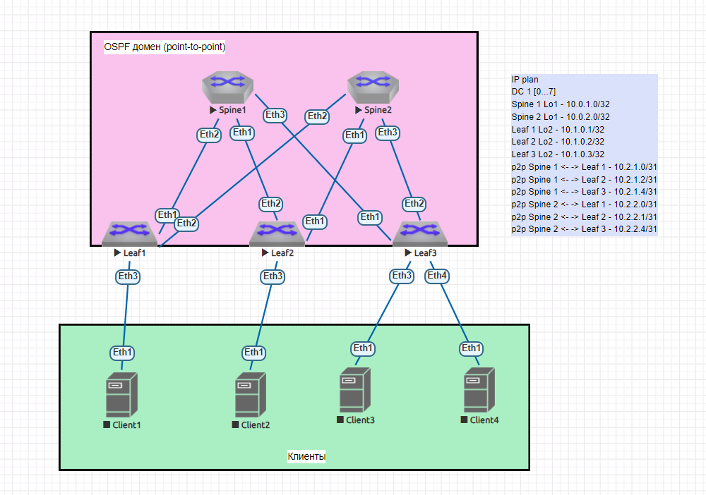

  # Underlay. OSPF

## Цель:
- Настроить OSPF для Underlay сети

## Описание/Пошаговая инструкция выполнения домашнего задания:

В этой самостоятельной работе мы ожидаем, что вы самостоятельно:

1) Настроите OSPF в Underlay сети, для IP связанности между всеми сетевыми устройствами.
2) Зафиксируете в документации - план работы, адресное пространство, схему сети, конфигурацию устройств
3) Убедитесь в наличии IP связанности между устройствами в OSFP домене

## Решение:

### Распределение адресного пространства

    IP plan
    DC 1 [0...7]
    Loopback
    Spine 1 Lo1 - 10.0.1.0/32
    Spine 2 Lo1 - 10.0.2.0/32
    Leaf 1 Lo2 - 10.1.0.1/32
    Leaf 2 Lo2 - 10.1.0.2/32
    Leaf 3 Lo2 - 10.1.0.3/32
    Service
    p2p Spine 1 <- -> Leaf 1 - 10.2.1.0/31
    p2p Spine 1 <- -> Leaf 2 - 10.2.1.2/31
    p2p Spine 1 <- -> Leaf 3 - 10.2.1.4/31
    p2p Spine 2 <- -> Leaf 1 - 10.2.2.0/31
    p2p Spine 2 <- -> Leaf 2 - 10.2.2.1/31
    p2p Spine 2 <- -> Leaf 3 - 10.2.2.4/31
    
### Конфигурация протокола OSPF
Сеть типа точка-точка состоит из пары маршрутизаторов. В сетях типа точка-точка маршрутизатор обнаруживает соседей, используя рассылку пакетов hello по мультикасту на адрес 224.0.0.5 (все маршрутизаторы OSPF). Как только появляется возможность передачи данных, маршрутизаторы немедленно устанавливают соседство, не проводя выборов DR и BDR (так как только 2 участника – в них нет необходимости). 
Интервалы OSPF по умолчанию для соединений типа точка-точка составляют 10 секунд для hello и 40 секунд для dead. 

### Схема сети

### Настройки оборудования

Spine1

      1 interface loopback1
      2 ip address 10.0.1.0/32
      3 interface ethernet1 
      4 ip address 10.2.1.2/31
      5 interface ethernet2
      6 ip address 10.2.1.0/31
      7 interface ethernet3
      8 ip address 10.2.1.4/31
      
Spine2    

      1 interface loopback1
      2 ip address 10.0.2.0/32
      3 interface ethernet1 
      4 ip address 10.2.2.1/31
      5 interface ethernet2
      6 ip address 10.2.2.0/31
      7 interface ethernet3
      8 ip address 10.2.2.4/31

Leaf1

      1 interface loopback2
      2 ip address 10.1.0.1/32
      3 interface ethernet1 
      4 ip address 10.2.1.1/31
      5 interface ethernet2
      6 ip address 10.2.2.1/31
      

Leaf2

      1 interface loopback2
      2 ip address 10.1.0.2/32
      3 interface ethernet1 
      4 ip address 10.2.2.2/31
      5 interface ethernet2
      6 ip address 10.2.1.3/31
      

Leaf3

      1 interface loopback2
      2 ip address 10.1.0.3/32
      3 interface ethernet1 
      4 ip address 10.2.1.5/31
      5 interface ethernet2
      6 ip address 10.2.2.5/31
      
