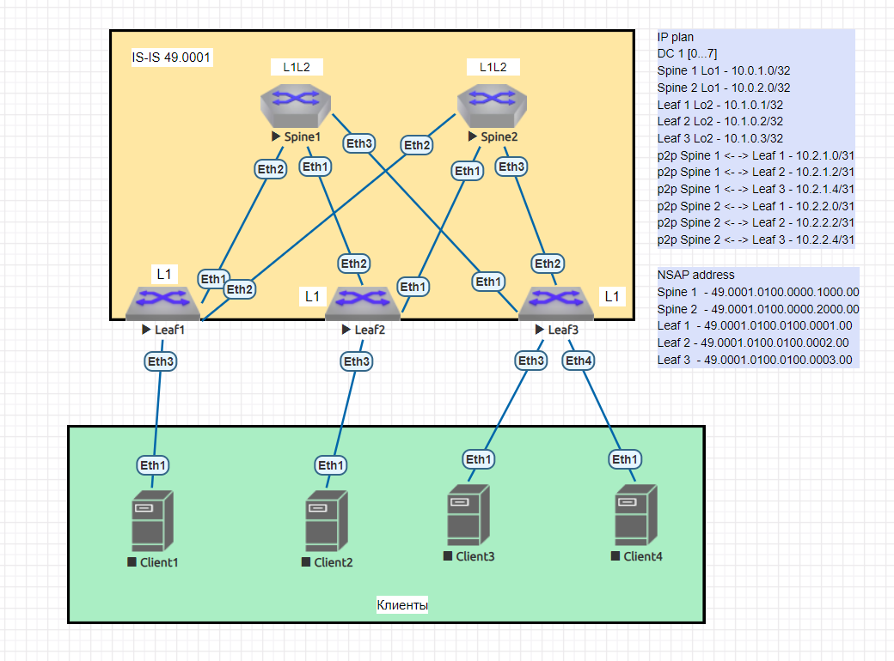

  # Underlay. IS-IS

## Цель:
- Настроить IS-IS для Underlay сети

## Описание/Пошаговая инструкция выполнения домашнего задания:

В этой самостоятельной работе мы ожидаем, что вы самостоятельно:

1) Настроите ISIS в Underlay сети, для IP связанности между всеми сетевыми устройствами.
2) Зафиксируете в документации - план работы, адресное пространство, схему сети, конфигурацию устройств
3) Убедитесь в наличии IP связанности между устройствами в ISIS домене

## Решение:

### План работы

Топология и распределение адресного пространства берутся из [lab01](https://github.com/samartyanov/otus-design-of-data-center-networks/tree/main/homework/lab01#%D0%BE%D0%BF%D0%B8%D1%81%D0%B0%D0%BD%D0%B8%D0%B5%D0%BF%D0%BE%D1%88%D0%B0%D0%B3%D0%BE%D0%B2%D0%B0%D1%8F-%D0%B8%D0%BD%D1%81%D1%82%D1%80%D1%83%D0%BA%D1%86%D0%B8%D1%8F-%D0%B2%D1%8B%D0%BF%D0%BE%D0%BB%D0%BD%D0%B5%D0%BD%D0%B8%D1%8F-%D0%B4%D0%BE%D0%BC%D0%B0%D1%88%D0%BD%D0%B5%D0%B3%D0%BE-%D0%B7%D0%B0%D0%B4%D0%B0%D0%BD%D0%B8%D1%8F).
Производится расчёт NSAP адресов (адреса указаны в таблице на схеме сети). После выполняется настройка ISIS на Spine и Leaf и проверка. Spine определены, как L1L2 под возможное расширение сети (появление Super-Spine в топологии).

### Распределение адресного пространства

    IP plan
    DC 1 [0...7]
    Loopback
    Spine 1 Lo1 - 10.0.1.0/32
    Spine 2 Lo1 - 10.0.2.0/32
    Leaf 1 Lo2 - 10.1.0.1/32
    Leaf 2 Lo2 - 10.1.0.2/32
    Leaf 3 Lo2 - 10.1.0.3/32
    Service
    p2p Spine 1 <- -> Leaf 1 - 10.2.1.0/31
    p2p Spine 1 <- -> Leaf 2 - 10.2.1.2/31
    p2p Spine 1 <- -> Leaf 3 - 10.2.1.4/31
    p2p Spine 2 <- -> Leaf 1 - 10.2.2.0/31
    p2p Spine 2 <- -> Leaf 2 - 10.2.2.2/31
    p2p Spine 2 <- -> Leaf 3 - 10.2.2.4/31
    
### Схема сети

### Настройки оборудования

Spine1

      Spine1(config)#router isis 1
      Spine1(config-router-isis)#net 49.0001.0100.0000.1000.00
      Spine1(config-router-isis)#is-type level-1-2
      Spine1(config-router-isis)#address-family ipv4 unicast
      Spine1(config-if-Lo1)#isis enable 1
      Spine1(config-if-Et1)#isis enable 1
      Spine1(config-if-Et1)#isis circuit-type level-1
      Spine1(config-if-Et2)#isis enable 1
      Spine1(config-if-Et2)#isis circuit-type level-1
      Spine1(config-if-Et3)#isis enable 1
      Spine1(config-if-Et3)#isis circuit-type level-1
      
Spine2    

      Spine2(config)#router isis 1
      Spine2(config-router-isis)#net 49.0001.0100.0000.2000.00
      Spine2(config-router-isis)#is-type level-1-2
      Spine2(config-router-isis)#address-family ipv4 unicast
      Spine2(config-if-Lo1)#isis enable 1
      Spine2(config-if-Et1)#isis enable 1
      Spine2(config-if-Et1)#isis circuit-type level-1
      Spine2(config-if-Et2)#isis enable 1
      Spine2(config-if-Et2)#isis circuit-type level-1
      Spine2(config-if-Et3)#isis enable 1
      Spine2(config-if-Et3)#isis circuit-type level-1

Leaf1

      Leaf1(config)#router isis 1
      Leaf1(config-router-isis)#net 49.0001.0100.0100.0001.00
      Leaf1(config-router-isis)#is-type level-1
      Leaf1(config-router-isis)#address-family ipv4 unicast
      Leaf1(config-if-Lo2)#isis enable 1
      Leaf1(config-if-Et1)#isis enable 1
      Leaf1(config-if-Et1)#isis circuit-type level-1
      Leaf1(config-if-Et2)#isis enable 1
      Leaf1(config-if-Et2)#isis circuit-type level-1
      

Leaf2

      Leaf2(config)#router isis 1
      Leaf2(config-router-isis)#net 49.0001.0100.0100.0002.00
      Leaf2(config-router-isis)#is-type level-1
      Leaf2(config-router-isis)#address-family ipv4 unicast
      Leaf2(config-if-Lo2)#isis enable 1
      Leaf2(config-if-Et1)#isis enable 1
      Leaf2(config-if-Et1)#isis circuit-type level-1
      Leaf2(config-if-Et2)#isis enable 1
      Leaf2(config-if-Et2)#isis circuit-type level-1
      

Leaf3

      Leaf3(config)#router isis 1
      Leaf3(config-router-isis)#net 49.0001.0100.0100.0003.00
      Leaf3(config-router-isis)#is-type level-1
      Leaf3(config-router-isis)#address-family ipv4 unicast
      Leaf3(config-if-Lo2)#isis enable 1
      Leaf3(config-if-Et1)#isis enable 1
      Leaf3(config-if-Et1)#isis circuit-type level-1
      Leaf3(config-if-Et2)#isis enable 1
      Leaf3(config-if-Et2)#isis circuit-type level-1
      
### Проверка работы протокола ISIS

Spine1

      VRF: default
      Codes: C - connected, S - static, K - kernel, 
             O - OSPF, IA - OSPF inter area, E1 - OSPF external type 1,
             E2 - OSPF external type 2, N1 - OSPF NSSA external type 1,
             N2 - OSPF NSSA external type2, B - Other BGP Routes,
             B I - iBGP, B E - eBGP, R - RIP, I L1 - IS-IS level 1,
             I L2 - IS-IS level 2, O3 - OSPFv3, A B - BGP Aggregate,
             A O - OSPF Summary, NG - Nexthop Group Static Route,
             V - VXLAN Control Service, M - Martian,
             DH - DHCP client installed default route,
             DP - Dynamic Policy Route, L - VRF Leaked,
             G  - gRIBI, RC - Route Cache Route
      
       I L1     10.0.2.0/32 [115/30] via 10.2.1.3, Ethernet1
                                     via 10.2.1.5, Ethernet3
       I L1     10.1.0.1/32 [115/40] via 10.2.1.3, Ethernet1
                                     via 10.2.1.5, Ethernet3
       I L1     10.1.0.2/32 [115/20] via 10.2.1.3, Ethernet1
       I L1     10.1.0.3/32 [115/20] via 10.2.1.5, Ethernet3
       I L1     10.2.2.0/31 [115/30] via 10.2.1.3, Ethernet1
                                     via 10.2.1.5, Ethernet3
       I L1     10.2.2.2/31 [115/20] via 10.2.1.3, Ethernet1
       I L1     10.2.2.4/31 [115/20] via 10.2.1.5, Ethernet3
     
      
Spine2    

        Spine2(config)#sh ip route isis
      
        VRF: default
        Codes: C - connected, S - static, K - kernel, 
               O - OSPF, IA - OSPF inter area, E1 - OSPF external type 1,
               E2 - OSPF external type 2, N1 - OSPF NSSA external type 1,
               N2 - OSPF NSSA external type2, B - Other BGP Routes,
               B I - iBGP, B E - eBGP, R - RIP, I L1 - IS-IS level 1,
               I L2 - IS-IS level 2, O3 - OSPFv3, A B - BGP Aggregate,
               A O - OSPF Summary, NG - Nexthop Group Static Route,
               V - VXLAN Control Service, M - Martian,
               DH - DHCP client installed default route,
               DP - Dynamic Policy Route, L - VRF Leaked,
               G  - gRIBI, RC - Route Cache Route
        
         I L1     10.0.1.0/32 [115/30] via 10.2.2.3, Ethernet1
                                       via 10.2.2.5, Ethernet3
         I L1     10.1.0.1/32 [115/20] via 10.2.2.1, Ethernet2
         I L1     10.1.0.2/32 [115/20] via 10.2.2.3, Ethernet1
         I L1     10.1.0.3/32 [115/20] via 10.2.2.5, Ethernet3
         I L1     10.2.1.0/31 [115/20] via 10.2.2.1, Ethernet2
         I L1     10.2.1.2/31 [115/20] via 10.2.2.3, Ethernet1
         I L1     10.2.1.4/31 [115/20] via 10.2.2.5, Ethernet3

Leaf1

      Leaf1(config)#sh ip route isis
      
      VRF: default
      Codes: C - connected, S - static, K - kernel, 
             O - OSPF, IA - OSPF inter area, E1 - OSPF external type 1,
             E2 - OSPF external type 2, N1 - OSPF NSSA external type 1,
             N2 - OSPF NSSA external type2, B - Other BGP Routes,
             B I - iBGP, B E - eBGP, R - RIP, I L1 - IS-IS level 1,
             I L2 - IS-IS level 2, O3 - OSPFv3, A B - BGP Aggregate,
             A O - OSPF Summary, NG - Nexthop Group Static Route,
             V - VXLAN Control Service, M - Martian,
             DH - DHCP client installed default route,
             DP - Dynamic Policy Route, L - VRF Leaked,
             G  - gRIBI, RC - Route Cache Route
      
       I L1     10.0.1.0/32 [115/40] via 10.2.2.0, Ethernet2
       I L1     10.0.2.0/32 [115/20] via 10.2.2.0, Ethernet2
       I L1     10.1.0.2/32 [115/30] via 10.2.2.0, Ethernet2
       I L1     10.1.0.3/32 [115/30] via 10.2.2.0, Ethernet2
       I L1     10.2.1.2/31 [115/30] via 10.2.2.0, Ethernet2
       I L1     10.2.1.4/31 [115/30] via 10.2.2.0, Ethernet2
       I L1     10.2.2.2/31 [115/20] via 10.2.2.0, Ethernet2
       I L1     10.2.2.4/31 [115/20] via 10.2.2.0, Ethernet2
      

Leaf2

      Leaf2(config)#sh ip route isis
      
      VRF: default
      Codes: C - connected, S - static, K - kernel, 
             O - OSPF, IA - OSPF inter area, E1 - OSPF external type 1,
             E2 - OSPF external type 2, N1 - OSPF NSSA external type 1,
             N2 - OSPF NSSA external type2, B - Other BGP Routes,
             B I - iBGP, B E - eBGP, R - RIP, I L1 - IS-IS level 1,
             I L2 - IS-IS level 2, O3 - OSPFv3, A B - BGP Aggregate,
             A O - OSPF Summary, NG - Nexthop Group Static Route,
             V - VXLAN Control Service, M - Martian,
             DH - DHCP client installed default route,
             DP - Dynamic Policy Route, L - VRF Leaked,
             G  - gRIBI, RC - Route Cache Route
      
       I L1     10.0.1.0/32 [115/20] via 10.2.1.2, Ethernet2
       I L1     10.0.2.0/32 [115/20] via 10.2.2.2, Ethernet1
       I L1     10.1.0.1/32 [115/30] via 10.2.2.2, Ethernet1
       I L1     10.1.0.3/32 [115/30] via 10.2.2.2, Ethernet1
                                     via 10.2.1.2, Ethernet2
       I L1     10.2.1.0/31 [115/20] via 10.2.1.2, Ethernet2
       I L1     10.2.1.4/31 [115/20] via 10.2.1.2, Ethernet2
       I L1     10.2.2.0/31 [115/20] via 10.2.2.2, Ethernet1
       I L1     10.2.2.4/31 [115/20] via 10.2.2.2, Ethernet1
      

Leaf3

      Leaf3(config)#sh ip route isis
      
      VRF: default
      Codes: C - connected, S - static, K - kernel, 
             O - OSPF, IA - OSPF inter area, E1 - OSPF external type 1,
             E2 - OSPF external type 2, N1 - OSPF NSSA external type 1,
             N2 - OSPF NSSA external type2, B - Other BGP Routes,
             B I - iBGP, B E - eBGP, R - RIP, I L1 - IS-IS level 1,
             I L2 - IS-IS level 2, O3 - OSPFv3, A B - BGP Aggregate,
             A O - OSPF Summary, NG - Nexthop Group Static Route,
             V - VXLAN Control Service, M - Martian,
             DH - DHCP client installed default route,
             DP - Dynamic Policy Route, L - VRF Leaked,
             G  - gRIBI, RC - Route Cache Route
      
       I L1     10.0.1.0/32 [115/20] via 10.2.1.4, Ethernet1
       I L1     10.0.2.0/32 [115/20] via 10.2.2.4, Ethernet2
       I L1     10.1.0.1/32 [115/30] via 10.2.2.4, Ethernet2
       I L1     10.1.0.2/32 [115/30] via 10.2.1.4, Ethernet1
                                     via 10.2.2.4, Ethernet2
       I L1     10.2.1.0/31 [115/20] via 10.2.1.4, Ethernet1
       I L1     10.2.1.2/31 [115/20] via 10.2.1.4, Ethernet1
       I L1     10.2.2.0/31 [115/20] via 10.2.2.4, Ethernet2
       I L1     10.2.2.2/31 [115/20] via 10.2.2.4, Ethernet2

### Проверка доступности узлов

      Spine1#ping 10.1.0.1
      PING 10.1.0.1 (10.1.0.1) 72(100) bytes of data.
      80 bytes from 10.1.0.1: icmp_seq=1 ttl=62 time=47.3 ms
      80 bytes from 10.1.0.1: icmp_seq=2 ttl=62 time=41.5 ms
      80 bytes from 10.1.0.1: icmp_seq=3 ttl=62 time=32.2 ms
      80 bytes from 10.1.0.1: icmp_seq=4 ttl=62 time=29.3 ms
      80 bytes from 10.1.0.1: icmp_seq=5 ttl=62 time=26.2 ms
      
      --- 10.1.0.1 ping statistics ---
      5 packets transmitted, 5 received, 0% packet loss, time 83ms
      rtt min/avg/max/mdev = 26.289/35.361/47.379/7.872 ms, pipe 4, ipg/ewma 20.952/40.834 ms
      
      
      Spine1#ping 10.1.0.2
      PING 10.1.0.2 (10.1.0.2) 72(100) bytes of data.
      80 bytes from 10.1.0.2: icmp_seq=1 ttl=64 time=8.57 ms
      80 bytes from 10.1.0.2: icmp_seq=2 ttl=64 time=7.04 ms
      80 bytes from 10.1.0.2: icmp_seq=3 ttl=64 time=6.85 ms
      80 bytes from 10.1.0.2: icmp_seq=4 ttl=64 time=7.16 ms
      80 bytes from 10.1.0.2: icmp_seq=5 ttl=64 time=7.79 ms
      
      --- 10.1.0.2 ping statistics ---
      5 packets transmitted, 5 received, 0% packet loss, time 39ms
      rtt min/avg/max/mdev = 6.857/7.487/8.573/0.627 ms, ipg/ewma 9.944/8.029 ms
      
      
      Spine1#ping 10.1.0.3
      PING 10.1.0.3 (10.1.0.3) 72(100) bytes of data.
      80 bytes from 10.1.0.3: icmp_seq=1 ttl=64 time=9.20 ms
      80 bytes from 10.1.0.3: icmp_seq=2 ttl=64 time=8.69 ms
      80 bytes from 10.1.0.3: icmp_seq=3 ttl=64 time=7.91 ms
      80 bytes from 10.1.0.3: icmp_seq=4 ttl=64 time=6.99 ms
      80 bytes from 10.1.0.3: icmp_seq=5 ttl=64 time=8.83 ms
      
      --- 10.1.0.3 ping statistics ---
      5 packets transmitted, 5 received, 0% packet loss, time 44ms
      rtt min/avg/max/mdev = 6.995/8.329/9.208/0.795 ms, ipg/ewma 11.008/8.752 ms
      
      
      Spine1#ping 10.0.2.0
      PING 10.0.2.0 (10.0.2.0) 72(100) bytes of data.
      80 bytes from 10.0.2.0: icmp_seq=1 ttl=63 time=16.6 ms
      80 bytes from 10.0.2.0: icmp_seq=2 ttl=63 time=18.8 ms
      80 bytes from 10.0.2.0: icmp_seq=3 ttl=63 time=21.4 ms
      80 bytes from 10.0.2.0: icmp_seq=4 ttl=63 time=21.6 ms
      80 bytes from 10.0.2.0: icmp_seq=5 ttl=63 time=22.2 ms
      
      --- 10.0.2.0 ping statistics ---
      5 packets transmitted, 5 received, 0% packet loss, time 68ms
      rtt min/avg/max/mdev = 16.675/20.175/22.203/2.098 ms, pipe 2, ipg/ewma 17.179/18.553 ms

